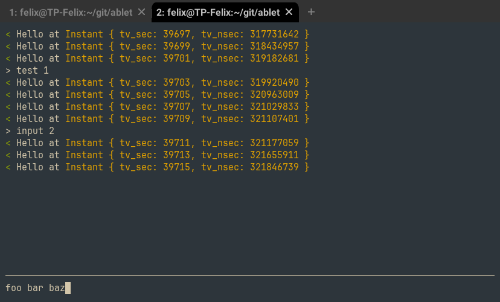

# Ablet

This is ablet, a proof of concept crate to create TUIs with very little effort.
It's inspired by [Matklad's design for Abont](https://github.com/matklad/abont).
In most cases the budget alternative to having a DSL is having a library, so that's
what I made here. 

The library provides buffers, documents and splits. A buffer holds a document,
which contains stylized text. Buffers can be arranged into a split tree, which can then
be rendered. Additionally, there is a very simple line editor that is part of this 
library, that you can use to edit (single line) buffers. Furthermore, everything
is behind Arc-Mutexes, so it's thread safe. The base idea is that you should roughly
have the same advantages using this library that you would have when writing an Emacs
plugin, but get a native program out of it.

The following example show how you could 
use this library to make a chat program where you have simultaneous data input from
a remote party and the keyboard:


```rust
fn run() -> io::Result<()> {
    // creates the output buffer
    let def_buffer = Buffer::new().into_ref();
    // creates the input buffer
    let prompt_buffer = Buffer::new().into_ref();
    // gets the document behind the buffer
    let prompt_doc = prompt_buffer.get_doc();
    prompt_buffer.set_cursor_visible(true);

    // creates a split tree: def buffer is dynamically sized and will take
    // the complete height (if you added a second buffer, or the same again, also with
    // 1) they'd share the space equally. And the prompt buffer has a fixed size (implied
    // by the !) of 1 row
    let tree = split_tree! {
        Vertical: {
            1: def_buffer,
            1!: prompt_buffer,
        }
    };

    // starts a thread that will print a message once a second and simulate asynchronously 
    // incoming chat messages
    let (tx_kill, rx_kill) = mpsc::sync_channel::<()>(1);
    start_background_thread(tree.clone(), def_buffer.clone(), rx_kill);

    // create the line editor
    let mut handler = SimpleLineHandler;
    loop {
        use SimpleLineHandlerResult::*;
        // hand control to the editor, and react to the outcomes
        match ablet::edit_buffer(&prompt_buffer, &tree, &mut handler)? {
            LineDone => {
                def_buffer.add_line(AText::from("> ".grey()) + prompt_doc.take());
            }
            Abort => {
                _ = tx_kill.send(());
                return Ok(());
            }
        }
    }
}

fn start_background_thread(splits: SplitTree, buf: BufferRef, rx_kill: Receiver<()>) {
    thread::spawn(move || {
        let mut last_msg_ts = Instant::now();
        loop {
            sleep(Duration::from_millis(1));
            if matches!(rx_kill.try_recv(), Ok(()) | Err(TryRecvError::Disconnected)) {
                return;
            }

            let now = Instant::now();
            if now.duration_since(last_msg_ts) > Duration::from_secs(2) {
                // add the message to the buffer
                buf.add_line(AText::from("< ".green()) + "Hello at " + format!("{now:?}").yellow());
                splits.render().unwrap();
                last_msg_ts = now;
            }
        }
    });
}
```

The result will automatically scale with the terminal and look like this:



To access io capabilities, you can use the ctevent module. It's a forward of 
[crossterm's event module](https://docs.rs/crossterm/latest/crossterm/event/index.html).

## State of this Crate

This crate is a proof of concept, to allow toying around with the idea of having
a text editor like ui library. It is vastly incomplete and nearly all usages will
require at least small additions to this crate. This is also the reason it's not on
crates.io. I will probably not develop this further, as it is enough to scratch my 
own itch, and I don't have enough free time. I'm happy to accept PRs if they
pass the few existing tests, and have no warnings or Clippy lints. Of course, 
you can also just fork this thing and take ownership. What follows is a list
of ideas and issues I'm aware of:


### Low-hanging fruits

#### A multiline editor

Should be quite easy, just look at the implementation of the line editor. Currently,
its located in lib.rs. Also, a Vim-like editor would be nice.

#### More cursor functions

Also quite easy, these would be implemented in the Buffer type, in buffers.rs. Examples
would be 
- move by word (forward and backward),
- get a range of the line that contains the cursor 
- move by line

Related to this a function in `AText` to modify the style of a range would be useful.

#### Mouse Interactions

There is a type called `SplitMap`, it maps concrete rectangles to buffer.
Currently private to the crate, that could be exposed, and gain a method that
converts click coordinates to buffer coordinates and return those together with
an identifier for the buffer. This would of course first require adding a field
for an identifier to the Buffer type. A buffer position could convert to a text
position given the size of the buffer, at which point you know what the user
clicked.

### Harder Things

#### Line Wrap & Selections

This would complicate the render logic quite a bit, and `View::render_doc` which this
ultimately comes down to is already complex enough to give me nightmares.
There is already some code that respects selections, but it's unused and untested so far,
and you'd need to write more code first to be even able to use it.

#### Windows Line Endings

I'm a linux user, and while this crate uses crossterm (which is platform independent),
it will probably not work on Windows, since on Windows a line ending is "\r\n", and on linux
it's just '\n'. All code just assumes Linux line endings, and unless all terminals in 
Windows insert Linux line endings, this won't work.

#### Unicode

Text is hard. I wanted to get this done quickly. All code assumes ASCII characters. 
Inputting a non ASCII character will crash your program. Since rust strings are by default
utf-8 this can probably be fixed by replacing all string slices with 
`.chars().dropping(start).take(end - start)`. The harder part is then cursor management
because you want the cursor on a grapheme cluster, which can be composed of multiple
utf-8 scalars, which is what is returned by `chars()`.

#### String inefficiency

The text type `AText` which represents styled text does it the following way:
it has a string and two vectors. The string holds the text one vector holds
text styles, and the other one holds an index into the styles vector for
each character in the string. This is a simple implementation, but it is very
inefficient for big amounts of text. I haven't looked into what text  editors
do, but there is definitely much room for improvement.

